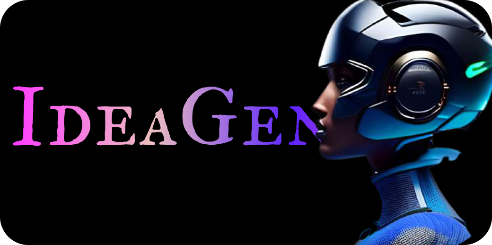
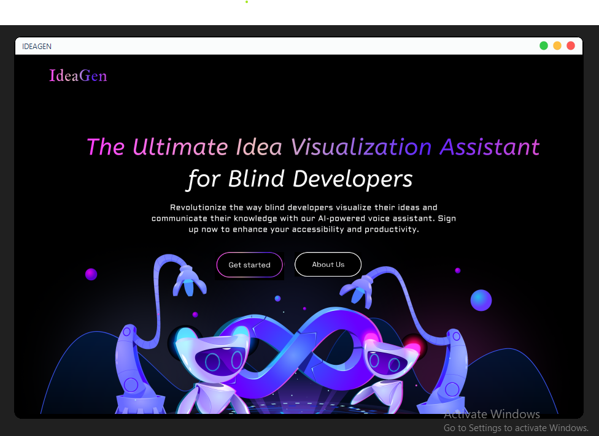
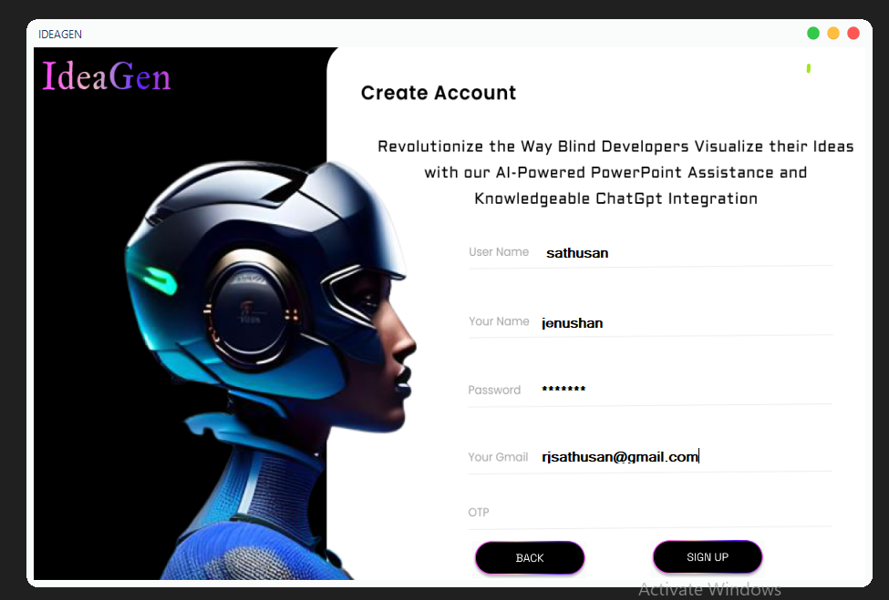

<div align="center">
    
</div>
  
 <div align="center">
<h1> 
Visualizing Ideas AI Voice Assistant for Blind Developers </h1>

</div> 
This project intends to develop an artificial intelligence voice assistant that can assist blind engineers in visualizing their concepts and ideas by using voice commands to produce PowerPoint presentations and reports without visual assistance. It aims to enhance the accessibility of visual materials and promote better communication and collaboration among visually impaired individuals in the workforce. By removing barriers to effective communication and enabling blind developers to showcase their ideas and concepts, this project seeks to promote inclusivity and 
diversity in the professional landscape. <b>[In Progress...]</b>


 

## Features
- Access unlimited knowledge through conversations using the ChatGpt integration.
- Create professional PowerPoint presentations,Proposels with suitable images using voice commands.
- Ability to automatically join meetings
- Communicate and get information by enabling contact with anyone.
- Navigate through the presentation using voice commands such as "Start Presentation", "Next", "Slide", and "Close".
- Receive audio feedback on the current slide being displayed to keep track of the presentation.

 

## Technologies Used
- Python 3.8 or higher and C# 8 or higher
- Google Cloud Speech, Beautifulsoup Modules
- 1Secmail and Pexels APIs
- Chat Gpt (alternative)
- Pexels API
- MySQL for the database

## Installation
Clone the repository:
```sh
git clone https://github.com/Rj-Sathusan/Visualizing-Ideas-An-AI-Powered-Assistant-for-Blind-Developers
```
## Install the required dependencies:
```sh
pip install -r requirements.txt
```

## Usage
Run the main script:
```sh
python main.py
```
Follow the voice prompts to describe your concept and start creating your presentation.

## Objectives
- Examine the problem domain and available technology critically.
- Create an accessible AI voice assistant system for blind developers. 
- Research and use voice recognition and text-to-speech technologies.
- Test the effectiveness and usability of the suggested system.
- Create thorough project documentation.

## Motivation
Blind developers face many challenges when working on projects, especially when it comes to creating presentations and reports . They struggle to generate and communicate their thoughts effectively because there aren't any visual tools available. By bridging this gap and giving blind developers a simple-to-use tool to help them visualize their ideas and thoughts, the creation of an AI voice assistant will contribute to closing the accessibility gap. This project is driven by the desire to give blind professionals equal chances in the software development industry and to increase their productivity and efficiency.

## Future Development
- Adding more features to enhance accessibility and productivity for blind developers.
- Improving the accuracy and efficiency of the ChatGpt integration.

## Contributing
Contributions are welcome! Please read the Contributing Guidelines before submitting a pull request.

## License
This project is licensed under the MIT License. See the LICENSE file for more information.
