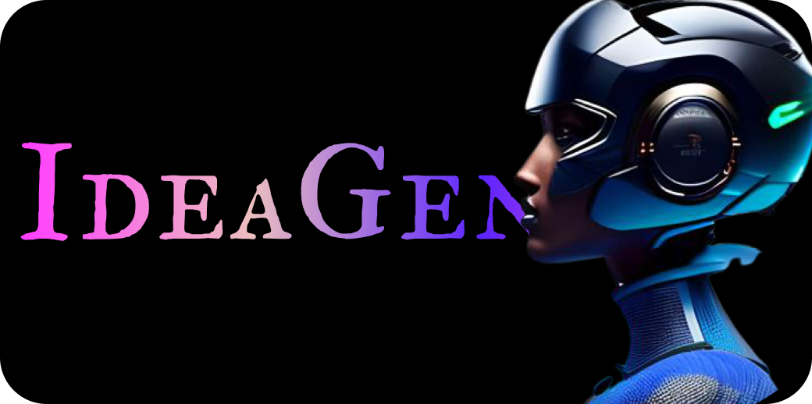
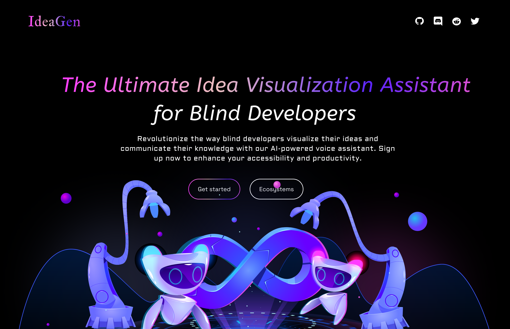
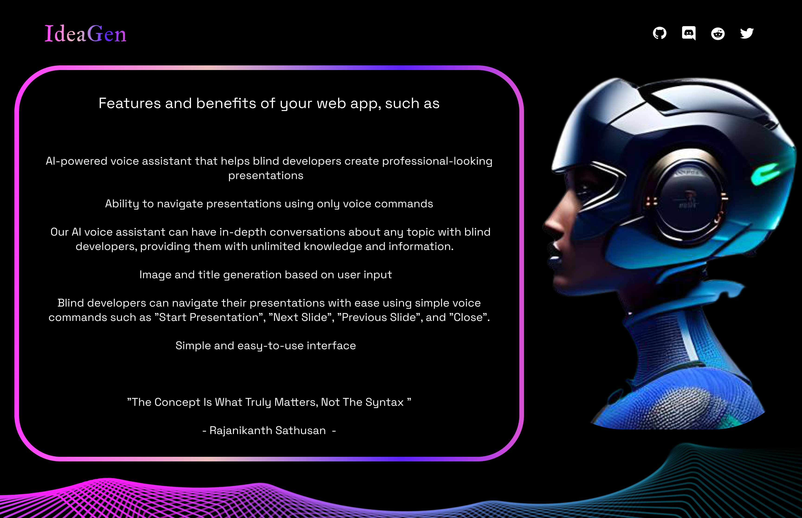

<div align="center">
    
</div>
  
 <div align="center">
<h1> 
Visualizing Ideas AI Voice Assistant for Blind Developers <h1>
</div>

  
This repository contains the source code for an AI-powered voice assistant designed specifically for blind developers. The voice assistant can help them create professional-looking PowerPoint presentations without the need for visual aids, and can even engage in unlimited knowledge conversations through the ChatGpt integration.

 

## Features
- Create professional PowerPoint presentations using voice commands.
- Generate suitable content such as titles, images, and notes based on user description.
- Access unlimited knowledge through conversations using the ChatGpt integration.
- Navigate through the presentation using voice commands such as "Start Presentation", "Next Slide", "Previous Slide", and "Close".
- Receive audio feedback on the current slide being displayed to keep track of the presentation.

 

## Technologies Used
- Python
- Pptx module
- Chat Gpt (alternative)
- Pexels API

## Installation
Clone the repository:
```sh
git clone https://github.com/Rj-Sathusan/Visualizing-Ideas-An-AI-Powered-Assistant-for-Blind-Developers
```
## Install the required dependencies:
```sh
pip install -r requirements.txt
```

## Usage
Run the main script:
```sh
python main.py
```
Follow the voice prompts to describe your concept and start creating your presentation.

## Future Development
- Adding more features to enhance accessibility and productivity for blind developers.
- Improving the accuracy and efficiency of the ChatGpt integration.

## Contributing
Contributions are welcome! Please read the Contributing Guidelines before submitting a pull request.

## License
This project is licensed under the MIT License. See the LICENSE file for more information.
